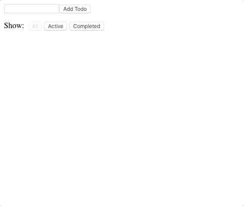

[](https://pursuit.org)

# Redux Two Lab

Building a todo app using redux!



## Learning Objectives

- Build a redux app from the ground up
- Understand redux hooks

## Standards

- FSW.7.b
- FSW.7.c

## Prerequisites

- React
- Redux
- Redux one lab

---

## Getting Started

1. Fork this repository.
1. Clone the forked repository to your computer.
1. `cd` to the cloned directory
1. run `create-react-app todo` in this directory to create a new project in a directory called `todo`.

## Technical Requirements
Build a todo app using Redux. This app does not require a Back-end to persist the data. Just using the redux store is enough.

A user should be able to:

1. Create a ToDo
2. Toggle a ToDo between completed and uncompleted
    - Clicking a non-completed ToDo should mark it as completed. Display the ToDo crossed out when completed.
    - Clicking a completed ToDo should mark the todo as active(not completed). Remove the crossing out.
3. [BONUS] Add buttons that filter by active(non-completed), completed, or all ToDos. 

Address this in order. Set up your store, reducer, and action for creating a todo first and verify it works. Then move to point 2 and 3.

### Todo Schema
A todo object should have the following properties.
```js
{
  id: 1,
  text: "Buy groceries",
  completed: true // or false
}
```

### State
Your state to store this information would look like:
```js
{
  nextTodoId: 1,
  todos: [],
  visibilityFilter: "all" // One of "all", "completed" or "active"
}
```

* `nexTodoId` is just a counter you will use to assign a simple `id` to your todos. Each time a new todo is added use the current value of `nextTodoId` to give your todo that `id` and increment `nextTodoId` there after for next time.
* `todos` keeps todo objects. 
* When the user click's the button Completed you will set the `visibilityFilter` and filter `todos` for only todos that are completed and display those completed todos.
* When the user click's the button Active you will filter `todos` for only todos that are **not** completed and display those non-completed todos to the user.

### Actions
Here are some suggestions for your actions and action types. You can, of course, come up with your own:
* `ADD_TODO`

```js
{
  type: 'ADD_TODO',
  payload: {
    text: 'Do something.'  
  }
}
```

* `TOGGLE_TODO`
* `SET_VISIBILITY_FILTER` 

## Submission Guidelines

- Commit your work, and make a pull request on this repository.

## Resources
* [React-Redux Basic Tutorial](https://react-redux.js.org/introduction/basic-tutorial)
* [Redux Basics Tutorial](https://redux.js.org/basics/basic-tutorial)
